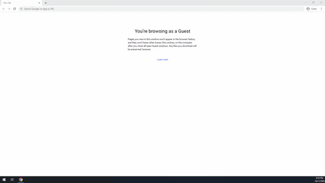
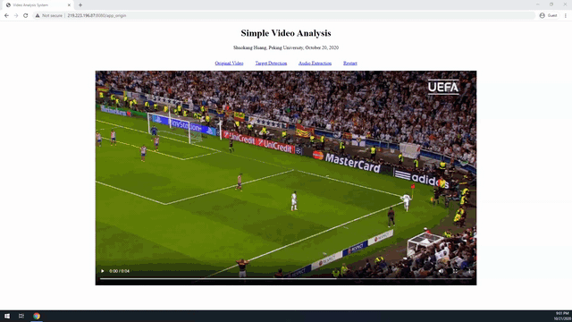
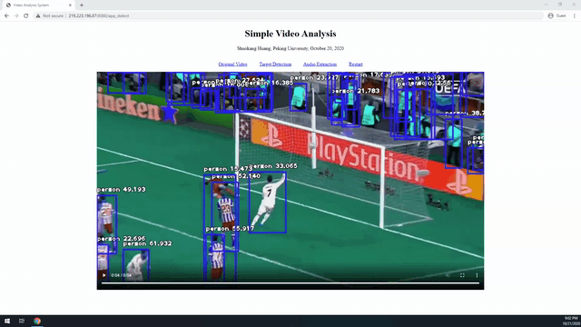

# Simple Video Analysis System

A simple deep learning based video analysis system, including a frontend to accept users’ video and a backend to process the video content and extract the audio. Concretely, three main features have been established in the system:

- Upload video to the system for further processing.

- Perform object detection on the video.

- Extract the audio from the video.

The frontend is several static pages, while the backend is based on the Flask framework. Further, the object detection utilize ImageAI which implements a RetinaNet model, while the audio extraction leverages the MoivePy tool. Since the model file is too large to upload to Github, please download it from [RetinaNet](https://github.com/OlafenwaMoses/ImageAI/releases/download/1.0/resnet50_coco_best_v2.0.1.h5) and place it in the folder "/Video_Analysis/models". The system supports both CPU and Nvidia GPU, and the GPU can significantly speed up the processing.

## Showcase
### 1. Upload video to the system for further processing.

### 2. Perform object detection on the video.

### 3. Extract the audio from the video.

### 4. Serve multiple users simultaneously.

## Requirement
- Ubuntu 18.04.4 LTS.
- Python 3.7.6.
- Frameworks and tools: TensorFlow 1.13.1, Keras 2.3.1, ImageAI 2.1.5, Flask 1.1.1, MoivePy 1.0.3.

## About Me
**Shuokang Huang** is currently working toward the M.Sc. degree in Computer Applied Technology in Peking University, China. He received the B.Eng. degree in Electronic Information Science and Technology from Sun Yat-sen University, Guangzhou, Guangdong, China, in 2018. His research interests are semi-supervised adversarial learning, heterogeneous feature embedding, deep neural networks and machine learning. (Oct. 22, 2020)
